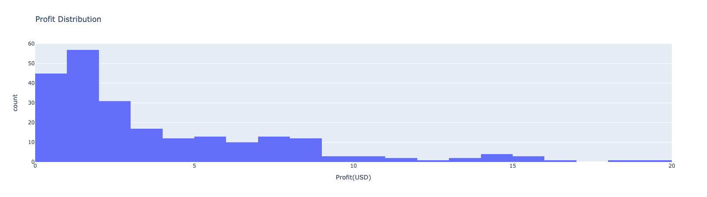
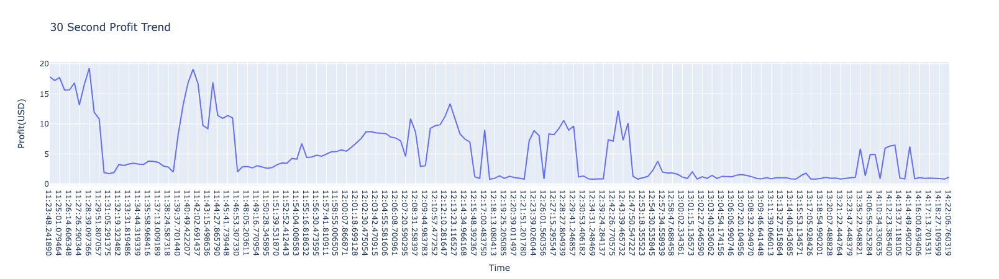
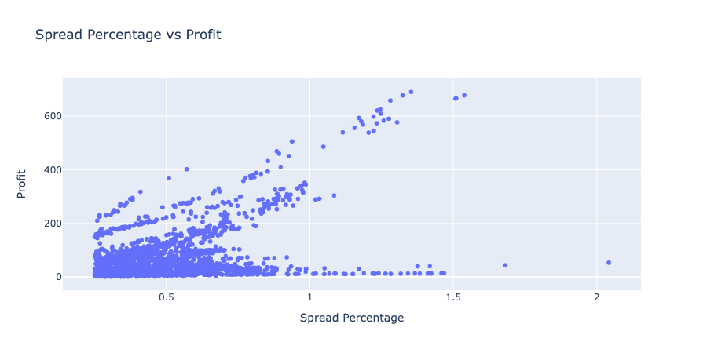
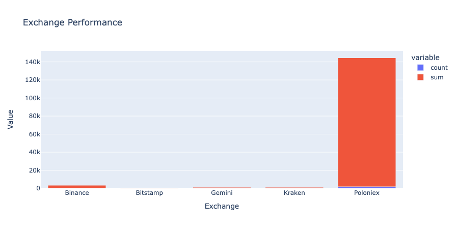
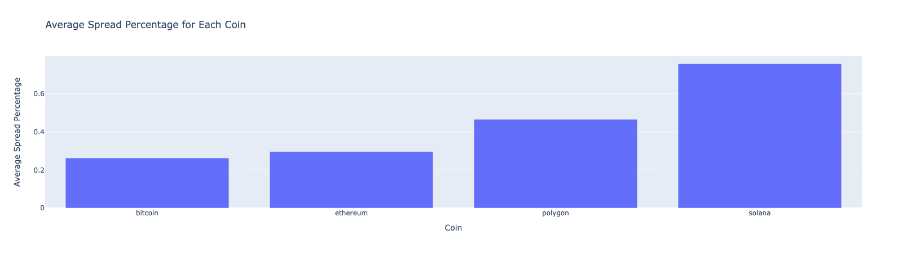

# Arbi: A Crypto Arbitrage Bot

## Overview
Arbi helps users find profits in the cryto market buy way of crypto arbitrage.    

Arbi scans multiple cryptocurrency exchanges in real-time to identify arbitrage opportunities by utilizing APIs from the exchanges to fetch live pricing data and calculate potential profits based on price differentials. 

Arbi uses the following:
- Exchanges: Binance, Bitstamp, Gemini, Kraken and Poloniex.
- Cryptocurrencies: Bitcoin, Ethereum, Polygon, Solana, and XRP.

## Table of Contents
links to different sections of the README 
- [Features](#features)
- [Getting Started](#getting-started)
    - [Prerequisites](#prerequisites)
    - [Installation](#installation)
- [Usage](#usage)
- [Results](#results-of-luffy-journey)
- [Roadmap](#roadmap)

## Features
- Automated arbitrage trading across multiple exchanges.
- Customizable trading strategies and risk management.

## Getting Started
#### Prerequisites

Ensure you have the following: 
- Anaconda Distribution - [Download Here](https://docs.anaconda.com/free/anaconda/install/)
- Conda Dependencies 
    - Jupyter Lab 
        ```bash
        conda install -c conda-forge jupyterlab
        ```
- Python Dependencies 
    - hvPlot, Pandas, Plotly, Python-Dotenv, Requests, SQLAlchemy 
        ```bash
        pip install hvplot pandas plotly python-dotenv requests sqlalchemy
        ```
- PostgreSQL and pgAdmin (latest version) - [Download Here](https://www.enterprisedb.com/downloads/postgres-postgresql-downloads)
- Create a database locally using pgAdmin called ```arbi_db```

#### Installation
1.  Clone the repository
    ```bash
    git clone https://github.com/objectmikael/arbi.git
    ```
2.  Navigate to project directory
    ```bash
    cd arbi
    ```
3. Create a file for your environment variables 
    ```bash
    touch .env
    ```
4. Open the dotenv file and add the following:
    ```txt
    PSQL_USERNAME = "enter your postgres username here"
    PSQL_PASSWORD = "enter your potgres password here"
    PSQL_HOST = "enter the server name here"
    PSQL_PORT = "enter the port number here"
    DB_NAME = "enter the database name here"
    ```
3.  Run script
    ```bash
    python main.py
    ```
    NOTE: Remember to create a gitignore file and add the dotenv file to it before pushing your code. 

## Usage
Repo File Structure:
- main.py
    - Contains the python script to execute the bot under several conditions:
        - A wallet size. Use the variable ```wallet``` to provide a dollar amount you wish to invest. Value should be an interger/float. 
        - An wallet allocation amount for each coin. Use the ```fund_allocation``` variable to provide your wallet allocation in a list in the following order ```[bitcoin, ethereum, polygon, solana, xrp]```. Summation of allocation values should equal 1. 
        - A threshold value. Use the ```min_profit_threshold``` variable to provide a minimum profit threshold. This value will manage the size of returns you're intrested in. Value will help account for fees, price slippage, etc. 

        The python script will create a unique table in your database. Experiement by changing the variables in the ```Global Variables``` section at the top of the script and run the bot at various times during the day to execute arbitrage opportunities and collect profits. 

- pseudocode.ipynb
    - A walkthorugh of the progression for the main script. Follow along to understand what was done, how it was done and why it was done. 

- 1.Research 
    - Contains a jupyter notebook that fetches OHLC data from each exchange via API and graphs the price of each coin over a given timeframe.
    - The Images folder contains zoomed in snapshots of each graph to confirm the opportunity for arbitrage.  

        NOTE: Each exchange uses unix time. The unix time stamp is the number of seconds ellapsed since the Unix Epoch on January 1st, 1970 at UTC. 

- 2.Control
    - The python script execute the bot under several conditions: 
        - No fees
        - 1 share per trade 
        - Spread Percentage > 0, which equates to only positive returns  
    - The jupyter notebook queries the database and displays several graphs.

- 3.LuffyJourney
    - The python script execute the bot under several conditions: 
        - Wallet size of $5642 (10% of Avg Annual Salary in the US)
        - Fund allocation for each coin:
            - Bitcoin 30%
            - Ethereum 15%
            - Polygon 35%
            - Solana 5%
            - XRP 15%
        - Spread Percentage > Minimum Profit Threshold
            - Minimum Profit Threshold 0.25% 

            NOTE: The threshold is meant to account for fees, price slippage, etc.  

## Results of Luffy Journey
- Trading Window: 3 hours 
- Trade interval: 30 seconds
- Total Trades: 231
- Total Profits: $926.88

**Profit Distribution** 

The distribution of profits across all trades provides insights into the consistency and variability of returns. There were 162 trades with a profit between $0 - $5 each.

**Profit Trend**

The examination of the 30 second trend of profits help to identify patterns and understand the overall performance of the arbitrage over time.

**Spread Percentage Analysis**

We explored the spread percentage to understand how much profit is generated relative to the spread. This helps to access the efficieny of the arbitrage strategy. If we were to change the minimum threshold for Luffy's Journey, we can get an idea of how many trades and how much profit would be generated by following the spread percentage value. 

**Exchange Performance**

By evaluating the performance of each exchange in terms of the number of trades and profit it helps in optimizing the selection of exchanges and diversifying risks. 181 trades were initiated from Poloniex and generated $435 in profits. 

**Average Spread Percentage by Coin**

We calculated the average spread percentge for each coin to identify coins with more favorable arbitrage opportunities. This helps in optimizing the selection of coins and diversifying risks. Solana performed the best with an average spread percentage of 0.76 followed by Polygon at 0.47.  


## Roadmap
Our future plans include:
- Refactor the codebase to be more efficient.
- Implement fee structure for each exchange. 
- Integrate with additonal exchanges and coins.
- Integrate smart contracts.
- Enhancing security measures. 

