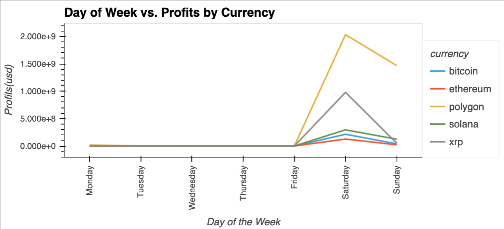
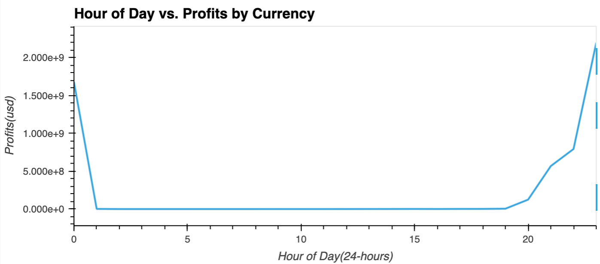
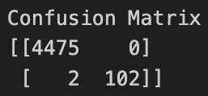
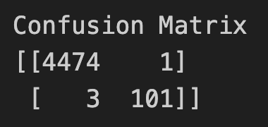
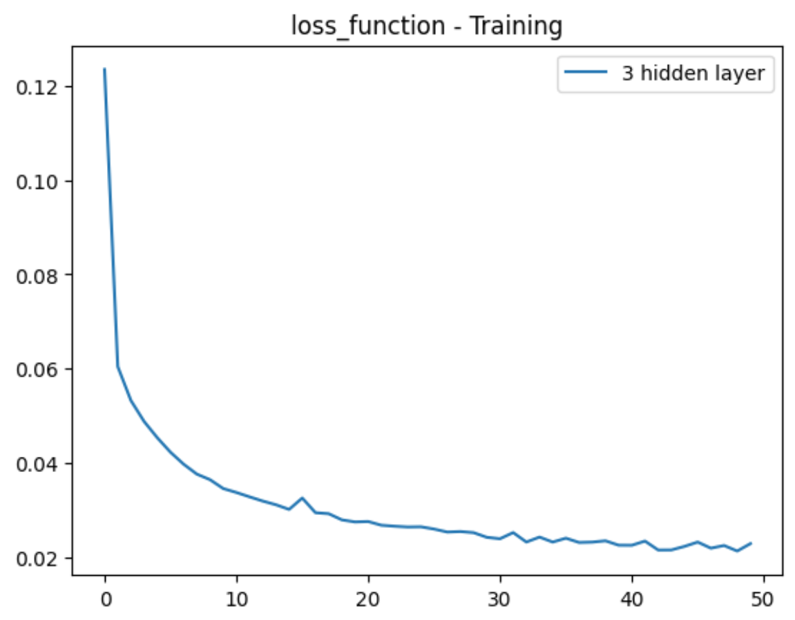

# ArbiML: A Crypto Arbitrage Bot with Machine Learning

## Overview
ArbiML integrates machine learning techniques to enhance the crypto arbitrage capabilities of the Arbi bot. Leveraging time series analysis and supervised learning models, ArbiML aims to predict profitable trades by understanding the underlying trends and patterns in cryptocurrency price data.

To identify the most profitable trades, ArbiML employs three distinct machine learning models:
- Logistic Regression: A statistical model for binary classification.
- Gradient Boosting: An ensemble method that builds decision trees sequentially.
- Neural Network: A deep learning model capable of capturing complex patterns.

By comparing these models on a modified dataset devoid of spread percentage features, ArbiML aims to determine the model with the highest accuracy for trade prediction.

> Review of Arbi V1: 
>
> Arbi helps users find profits in the cryto market buy way of crypto arbitrage.    
>
> Arbi scans multiple cryptocurrency exchanges in real-time to identify arbitrage opportunities by utilizing APIs from the exchanges to fetch live pricing data and calculate potential profits based on price differentials. 
>
> Arbi uses the following:
> - Exchanges: Binance, Bitstamp, Gemini, Kraken and Poloniex.
> - Cryptocurrencies: Bitcoin, Ethereum, Polygon, Solana, and XRP.
>

## Table of Contents
links to different sections of the README 
- [Features](#features)
- [Getting Started](#getting-started)
    - [Prerequisites](#prerequisites)
    - [Installation](#installation)
- [Usage](#usage)
- [Results](#results-of-luffy-journey)
- [Roadmap](#roadmap)

## Features
- Automated arbitrage trading across multiple exchanges.
- Customizable trading strategies and risk management.
- Machine Learning model for enhanced capabilities. 

## Getting Started
#### Prerequisites

Ensure you have the following: 
- Anaconda Distribution - [Download Here](https://docs.anaconda.com/free/anaconda/install/)
- Conda Dependencies 
    - Jupyter Lab 
        ```bash
        conda install -c conda-forge jupyterlab
        ```
- Python Dependencies 
    - hvPlot, Pandas, Plotly, Python-Dotenv, Requests, SQLAlchemy 
        ```bash
        pip install hvplot pandas plotly python-dotenv requests sqlalchemy
        ```
- PostgreSQL and pgAdmin (latest version) - [Download Here](https://www.enterprisedb.com/downloads/postgres-postgresql-downloads)
- Create a database locally using pgAdmin called ```arbi_db```

#### Installation
1.  Clone the repository
    ```bash
    git clone https://github.com/objectmikael/arbi.git
    ```
2.  Navigate to project directory
    ```bash
    cd arbi
    ```
3. Create a file for your environment variables 
    ```bash
    touch .env
    ```
4. Open the dotenv file and add the following:
    ```txt
    PSQL_USERNAME = "enter your postgres username here"
    PSQL_PASSWORD = "enter your potgres password here"
    PSQL_HOST = "enter the server name here"
    PSQL_PORT = "enter the port number here"
    DB_NAME = "enter the database name here"
    ```
3.  Run script
    ```bash
    python main.py
    ```
    NOTE: Remember to create a gitignore file and add the dotenv file to it before pushing your code. 

## Usage
Repo File Structure:
- main.py
    - Contains the python script to execute the bot under several conditions:
        - A wallet size. Use the variable ```wallet``` to provide a dollar amount you wish to invest. Value should be an interger/float. 
        - An wallet allocation amount for each coin. Use the ```fund_allocation``` variable to provide your wallet allocation in a list in the following order ```[bitcoin, ethereum, polygon, solana, xrp]```. Summation of allocation values should equal 1. 
        - A threshold value. Use the ```min_profit_threshold``` variable to provide a minimum profit threshold. This value will manage the size of returns you're intrested in. Value will help account for fees, price slippage, etc. 

        The python script will create a unique table in your database. Experiement by changing the variables in the ```Global Variables``` section at the top of the script and run the bot at various times during the day to execute arbitrage opportunities and collect profits. 

- 1_Time Series Analysis
    - Contains a jupyter notebook that examines time series components.

- 2_Statistical Learning 
    - Contains two jupyter notebooks, one to examine a Logistic Regression Model and the other, a Gradient Boosting Model.

- 3_Neural Networks and Deep Learning
    - Contains a jupyter notebook that examines a Sequential Model.

## Results

**Time Series Analysis:** 
ArbiML utilizes time series components to capture the inherent patterns in cryptocurrency prices:
- Trend: Weekly trends over a span of 10 days.

    

    The trend analysis highlighted weekends as the most profitable days for trading, indicating a recurring pattern that traders can leverage.

- Seasonality: Daily variations observed over a 24-hour period.

    

    The seasonality analysis pinpointed the evening hours from 7 pm to 1 am as the most profitable time slots, offering traders a specific timeframe to focus on for maximizing arbitrage opportunities.


**Logistic Regression:**
The model achieved an accuracy score of 99.96%, indicating high performance in predicting profitable trades. However, it's important to remember that no model is infallible. Even with high accuracy, there's still a small risk of making trades that could result in losses.
- Confusion Matrix: Provides a detailed breakdown of a model's predictions compared to the actual outcomes. 

    
    - **False Positives (FP):**
        - **Advantage:** The model has zero false positives, meaning it never incorrectly labeled a non-profitable trade as profitable. This is excellent as it ensures that we avoid making trades that might cost us money.
        - **Disadvantage:** While having no false positives is beneficial for risk mitigation, an overly cautious model might miss out on some potentially profitable trades if it's too conservative in its predictions.
    - **False Negatives (FN):**
        - **Advantage:** The model has only two false negatives, indicating a high accuracy in correctly identifying profitable trades.
        - **Disadvantage:** However, false negatives mean that there were trades the model missed labeling as profitable. This could result in missed opportunities for gains.

**Gradient Boosting**
The overall accuracy of the model is 99.91%, demonstrating its effectiveness in classifying trades as profitable or non-profitable based on the provided features.
- Confusion Matrix: Provides a detailed breakdown of a model's predictions compared to the actual outcomes.

    

    - **False Positives (FP):**
        - **Advantage:** The model has only one false positive, indicating a high accuracy in avoiding incorrectly labeling non-profitable trades as profitable.
        - **Disadvantage:** While minimizing false positives is beneficial for risk management, an overly cautious approach might overlook some profitable trading opportunities.
    - **False Negatives (FN):**
        - **Advantage:** The model has three false negatives, which is relatively low, indicating a high accuracy in identifying profitable trades.
        - **Disadvantage:** False negatives imply that there were trades the model failed to identify as profitable, potentially leading to missed opportunities for gains.

**Neural Network**
The model achieved an accuracy of 98.88%, meaning it correctly predicted whether a trade is profitable or not in 98.88% of the cases. This high accuracy demonstrates the model's strong performance and reliability in classifying trades based on the provided features. 
- Loss Function: 

    

    The model's low binary cross-entropy loss of 0.0257 indicates that the predicted probabilities for each trade being profitable are very close to the actual labels. In other words, the model's predictions are highly accurate, with minimal errors when compared to the true outcomes.
    
By evaluating the performance of each model in terms of its accuracy, the Logistic Regression model was first in class with 99.96% accuracy. 


## Roadmap
Our future plans include:
- Optimizing model performance. 
- Incorporating additional machine learning techniques.
- Integrate smart contracts.
- Enhancing security measures. 
- Implementing real-time monitoring and alerting mechanisms for timely trade execution.

